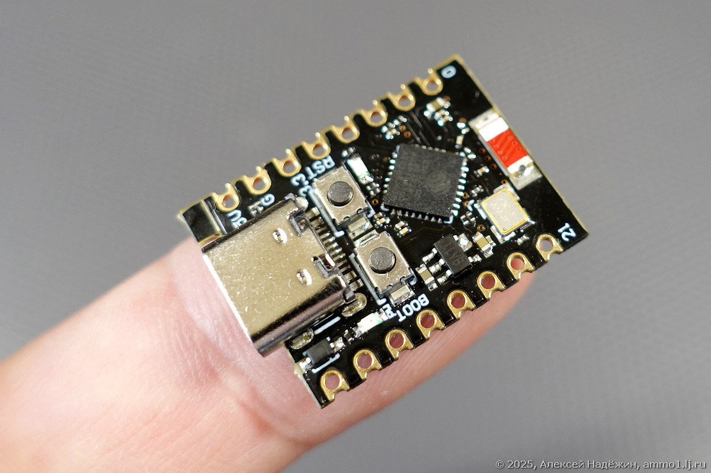

# HTTPd PoC

PoC of a esp-idf http server project with a compressed static web engine


## Requirements
node v25.2.1  
esp-idf v5.5.2


*ESP32-C3 Super Mini*

## Remark
Before starting the build, configure the esp-idf project.

```
cd firmware
source ~/esp/{version}/esp-idf/export.sh
idf.py set-target esp32
idf.py menuconfig
```

I also recommend installing Volta.
```
curl https://get.volta.sh | bash
```
